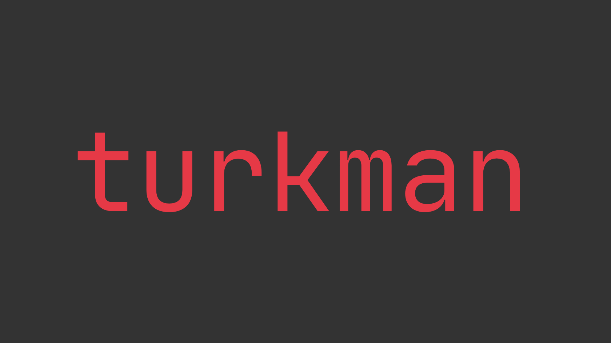

<div align="right">

[Turkish](README.md) | 🇬🇧 English (README.en.md)

</div>

# Turkman - Turkish Man Pages for Linux

<div align="center">



[](https://github.com/mmapro12/turkman/releases)
[](LICENSE)
[](https://python.org)
[](https://github.com/mmapro12/turkman)

**Translates Linux command man pages into Turkish and lets you access system documentation in your native language.**

[🚀 Quick Install](#-quick-install) • [📖 Usage](#-usage) • [🤝 Contribute](#-contributing) • [📚 Documentation](#-documentation)

</div>

---

## ✨ Features

🌐 **Multi-Source Support** - Translations from local man pages, SQLite database, and GitHub repository  
📊 **Smart Caching** - Fast access with SQLite-based local cache  
🔄 **Auto Update** - Automatically syncs latest translations from GitHub  
🎯 **Smart Search** - Optimized search order: Local → Database → GitHub  
🖥️ **Modern CLI** - User-friendly Typer-based command line interface  
⚡ **Fast & Lightweight** - Minimal system resource usage

---

## 🚀 Quick Install

### 📦 Install via APT (stable) (Recommended)

If you are using Ubuntu(24+), ZorinOS etc. you can use this tested script to install turkman: 

```bash
# Download the .deb package
curl -L -o turkman_0.8.0_all.deb https://github.com/mmapro12/turkman/releases/latest/download/turkman_0.8.0_all.deb

# Install the package
sudo dpkg -i turkman_*_all.deb # may give error, ignore and run next:
sudo apt install -f  # Fix dependencies
turkman db sync # Update database
```

### 🔧 Install via Script (dev)

If you are using Pardus, Debian etc. you can install turkman using this script. Also you can install turkman on any distribution with this script:

```bash
git clone https://github.com/mmapro12/turkman.git
cd turkman 
chmod +x install.sh
./install.sh
cd ..
rm -rf turkman
```

### 📋 System Requirements

- **Operating System**: All Linux distributions supported.
- **Python**: 3.8 or higher
- **Dependencies**: `manpages-tr`, `python3-requests`, `python3-typer`
- If you use install.sh, you don't need to install manpages-tr manually. It will be installed automatically.

---

## 📖 Usage

### 🎯 Basic Commands

```bash
# Show Turkish man page for any command
turkman ls
turkman clear

# Check version
turkman version

# Update translation database
turkman db sync
```

### 🔍 How It Works

When searching for a translation, Turkman follows this **order**:

```
1️⃣ Local Turkish Man Pages (/usr/share/man/tr/)
    ↓ (If not found)
2️⃣ Local SQLite Database (~/.turkmandb/)
    ↓ (If not found)  
3️⃣ AI Translation (In development)
    ↓ (If not possible)
4️⃣ Original English Man Page (Redirect)
```

### 📊 Command Reference

| Command | Description |
|---------|-------------|
| `turkman <command>` | Show Turkish man page for the given command |
| `turkman version` | Show version info |
| `turkman update` | Update Turkman |
| `turkman db init` | Initialize database |
| `turkman db sync` | Sync translations |
| `turkman uninstall` | Uninstall Turkman |
| `turkman --help` | Show help menu |

---

## 🛠️ Advanced Usage

### 🔄 Database Management

```bash
# Reset and reinitialize database
rm -rf ~/.turkmandb
turkman db init
turkman db sync

# Check database status
ls -la ~/.turkmandb/
```

### 🌐 Offline Usage

Turkman caches translations locally, so it works offline:

```bash
# Download translations first
turkman db sync

# Now you can use it offline
turkman ani-cli  # Shows from local cache
```

---

## 🏗️ Project Architecture

### 📊 System Architecture


### 🗂️ Project Structure

```
turkman/
├── src/turkman/
│   ├── __init__.py
│   ├── turkman.py         # Main CLI app
│   ├── db.py              # Database management
│   ├── utils.py           # Utility functions
│   └── version.py         # Version info
├── build_deb.sh           # .deb package builder
├── install.sh             # .deb package installer/downloader
├── setup.py               # Python package config
├── README.md              # This file
├── version.txt            # Version info
└── LICENSE                # GPL-3.0 license
```

---

## 🤝 Contributing

### 🎯 Types of Contributions

- 🌍 **New Translations**: Translate man pages into Turkish
- 🔧 **Bug Fixes**: Fix existing issues  
- ⚡ **Feature Development**: Add new features
- 📚 **Documentation**: Improve docs
- 🐛 **Bug Reporting**: Report issues

### 📝 Translation Contribution

1. **Fork the Turkmandb repo**: [github.com/mmapro12/turkmandb](https://github.com/mmapro12/turkmandb)

2. **Add new translation**:
```bash
cd turkmandb/pages/
# Write translation in man format
echo "MAN_PAGE_CONTENT" > new_command
```

3. **Update translation list**:
```bash
echo "new_command" >> ../pages.txt
```

4. **Send a pull request**

### 💻 Code Contribution

```bash
# Fork and clone the project
git clone https://github.com/mmapro12/turkman.git
cd turkman

# Set up development environment
python -m venv venv
source venv/bin/activate
pip install -e .
pip install -r requirements.txt

# Make and test your changes
python -m turkman.turkman ls

# Commit and push
git add .
git commit -m "feat: added new feature"
git push origin main
```

---

## 🔧 Troubleshooting

### ❗ Common Problems

#### "Command not found" Error
```bash
# Check if the command exists on your system
which command_name
man command_name
```

#### "Translation not found" Error
```bash
# Update the database
turkman db sync

# Check local Turkish man pages
man -L tr command_name
```

#### Database Issues
```bash
# Reset the database
rm -rf ~/.turkmandb
turkman db init
turkman db sync
```

### 📞 Support

If you still have issues:
- 🐛 **GitHub Issues**: [Report an issue](https://github.com/mmapro12/turkman/issues)

---

## 🎯 Roadmap

- 🤖 **AI-Powered Translation**: Automatic AI translation system
- 🐧 **Distribution Support**: Red Hat, Arch Linux support
- 📱 **GUI Interface**: Desktop app development
- 📖 **Python Documentation**: Python library documentation support

---

## 📄 License

This project is licensed under [GPL-3.0](LICENSE).

---

## 🔗 Links

<div align="center">

[](https://github.com/mmapro12/turkman)
[](https://github.com/mmapro12/turkmandb)
[](https://github.com/mmapro12/turkman/releases)
[](https://github.com/mmapro12/turkman/issues)

</div>

---

## 🙏 Thanks

- 🌟 **Contributors**: Thanks to all translators and developers
- 📖 **Community**: Thanks to the Linux Turkey community for their support
- 🛠️ **Tools**: Thanks to Python, SQLite, GitHub, and the open source ecosystem

*Made with love in Maraş.* 
