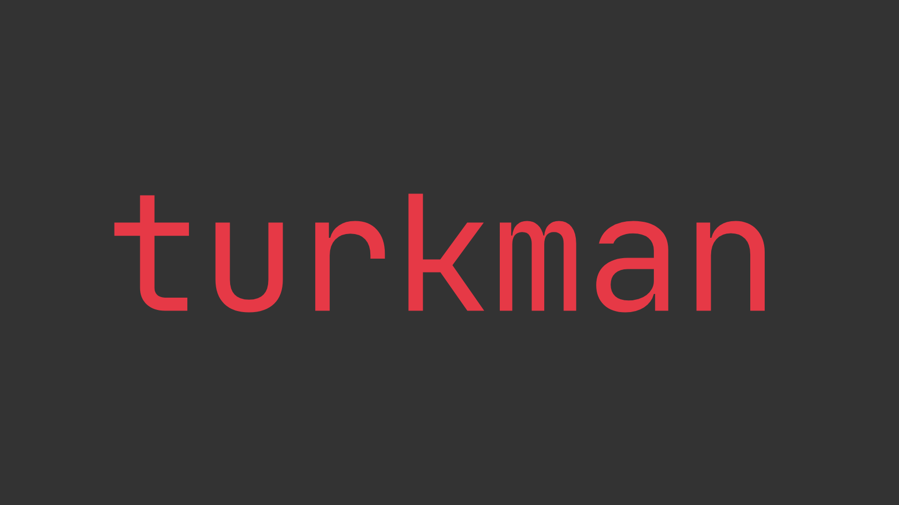
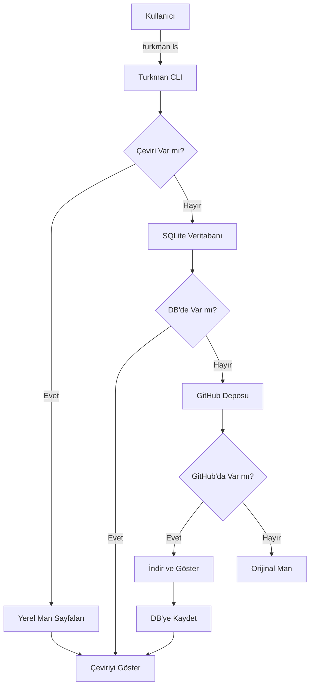

# Turkman - Linux için Türkçe Man Sayfaları

<div align="center">



[](https://github.com/mmapro12/turkman/releases)
[](LICENSE)
[](https://python.org)
[](https://github.com/mmapro12/turkman)

**Linux komutlarının man sayfalarını Türkçeye çevirir ve ana dilinizde sistem dokümantasyonuna erişmenizi sağlar.**

[🚀 Hızlı Kurulum](#-hızlı-kurulum) • [📖 Kullanım](#-kullanım) • [🤝 Katkıda Bulun](#-katkıda-bulunma) • [📚 Dokümantasyon](#-dokümantasyon)

</div>

---

## ✨ Özellikler

🌐 **Çoklu Kaynak Desteği** - Yerel man sayfaları, SQLite veritabanı ve GitHub deposundan çeviriler  
📊 **Akıllı Önbellekleme** - Hızlı erişim için SQLite tabanlı yerel önbellek  
🔄 **Otomatik Güncelleme** - GitHub deposundan güncel çevirileri otomatik senkronizasyon  
🎯 **Akıllı Arama** - Yerel → Veritabanı → GitHub sıralamasıyla optimize edilmiş arama  
🖥️ **Modern CLI** - Typer tabanlı kullanıcı dostu komut satırı arayüzü  
⚡ **Hızlı ve Hafif** - Minimal sistem kaynağı kullanımı

---

## 🚀 Hızlı Kurulum

### 📦 APT ile Kurulum (stable) (Önerilen)

```bash
# .deb paketini indirin
curl -L -o turkman_0.7.0_all.deb https://github.com/mmapro12/turkman/releases/latest/download/turkman_0.7.0_all.deb

# Paketi kurun
sudo dpkg -i turkman_*_all.deb # hata verebilir aldırış etmeyin sonraki adıma geçin:
sudo apt install -f  # Bağımlılıkları çözün
```

### 🔧 Script ile Kurulum (dev)

Bu script ile herhangi bir dağıtımda turkman'ı kurabilirsiniz:

```bash
git clone https://github.com/mmapro12/turkman.git
cd turkman 
chmod +x install.sh
./install.sh
cd ..
rm -rf turkman
```

### İndirdikten sonra:
```bash
turkman db sync # Turkmandb'yi init'lemek ve en güncel sürümde tutmak için turkman'ı indirdikten sonra bu komutu yazın.
```

### 📋 Sistem Gereksinimleri

- **İşletim Sistemi**: Tüm Linux işletim sistemleri desteklidir.
- **Python**: 3.8 veya üzeri
- **Bağımlılıklar**: `manpages-tr`, `python3-requests`, `python3-typer`
- Turkman'ı install.sh script'tinden indiriyorsanız manpages-tr'ı indirmenize gerek yok. Otomatikmen kurulur.

---

## 📖 Kullanım

### 🎯 Temel Komutlar

```bash
# Herhangi bir komutun Türkçe man sayfasını görüntüle
turkman ls
turkman clear

# Sürüm bilgisini kontrol et
turkman version

# Çeviri veritabanını güncelle
turkman db sync
```

### 🔍 Çalışma Prensibi

Turkman, bir komut için çeviri ararken şu **sıralamayı** takip eder:

```
1️⃣ Yerel Tüürkçe Man Sayfaları (/usr/share/man/tr/)
    ↓ (Bulunamadıysa)
2️⃣ Yerel SQLite Veritabanı (~/.turkmandb/)
    ↓ (Bulunamadıysa)  
3️⃣ Yapay zeka ile çevirme (Geliştirme aşamasında)
    ↓ (Yapılamazsa)
4️⃣ Orijinall İngilizce Man Sayfası (Yönlendirme)
```

### 📊 Komut Referansı

| Komut | Açıklama |
|-------|----------|
| `turkman <komut>` | Belirtilen komutun Türkçe man sayfasını göster |
| `turkman version` | Sürüm bilgilerini göster |
| `turkman update` | Turkman'ı güncelle |
| `turkman db init` | Veritabanını başlat |
| `turkman db sync` | Çevirileri senkronize et |
| `turkman uninstall` | Turkman'ı kaldır |
| `turkman --help` | Yardım menüsünü göster |

---

## 🛠️ Gelişmiş Kullanım

### 🔄 Veritabanı Yönetimi

```bash
# Veritabanını sıfırla ve yeniden başlat
rm -rf ~/.turkmandb
turkman db init
turkman db sync

# Veritabanı durumunu kontrol et
ls -la ~/.turkmandb/
```

### 🌐 Çevrimdışı Kullanım

Turkman, çevirileri yerel olarak önbelleğe aldığından internet bağlantısı olmadan da çalışabilir:

```bash
# İlk seferinde çevirileri indir
turkman db sync

# Artık çevrimdışı kullanabilirsiniz
turkman ani-cli  # Yerel önbellekten gösterir
```

---

## 🏗️ Proje Mimarisi

### 📊 Sistem Mimarisi



### 🗂️ Proje Yapısı

```
turkman/
├── src/turkman/
│   ├── __init__.py
│   ├── turkman.py         # Ana CLI uygulaması
│   ├── db.py              # Veritabanı yönetimi
│   ├── utils.py           # Yardımcı fonksiyonlar
│   └── version.py         # Sürüm bilgisi
├── build_deb.sh           # .deb paketi oluşturma
├── install.sh             # .deb paketi oluşturma ve indirme
├── setup.py               # Python paketi yapılandırması
├── README.md              # Bu dosya
├── version.txt            # Sürüm bilgisi
└── LICENSE                # GPL-3.0 lisansı
```

---

## 🤝 Katkıda Bulunma

### 🎯 Katkı Türleri

- 🌍 **Yeni Çeviriler**: Man sayfalarını Türkçeye çevirin
- 🔧 **Hata Düzeltmeleri**: Mevcut sorunları çözün  
- ⚡ **Özellik Geliştirme**: Yeni fonksiyonlar ekleyin
- 📚 **Dokümantasyon**: Belgeleri iyileştirin
- 🐛 **Hata Raporlama**: Sorunları bildirin

### 📝 Çeviri Katkısı

1. **Turkmandb deposunu fork edin**: [github.com/mmapro12/turkmandb](https://github.com/mmapro12/turkmandb)

2. **Yeni çeviri ekleyin**:
```bash
cd turkmandb/pages/
# Man formatında çeviri yazın
echo "MAN_SAYFASI_İÇERİĞİ" > yeni_komut
```

3. **Çeviri listesini güncelleyin**:
```bash
echo "yeni_komut" >> ../pages.txt
```

4. **Pull request gönderin**

### 💻 Kod Katkısı

```bash
# Projeyi fork edin ve klonlayın
git clone https://github.com/mmapro12/turkman.git
cd turkman

# Geliştirme ortamını kurun
python -m venv venv
source venv/bin/activate
pip install -e .
pip install -r requirements.txt

# Değişikliklerinizi yapın ve test edin
python -m turkman.turkman ls

# Commit edin ve push edin
git add .
git commit -m "feat: yeni özellik eklendi"
git push origin main
```

---

## 🔧 Sorun Giderme

### ❗ Yaygın Problemler

#### "Komut bulunamadı" Hatası
```bash
# Komutun sistem üzerinde olup olmadığını kontrol edin
which komut_adı
man komut_adı
```

#### "Çeviri bulunamadı" Hatası
```bash
# Veritabanını güncelleyin
turkman db sync

# Yerel Türkçe man sayfalarını kontrol edin
man -L tr komut_adı
```

#### Veritabanı Sorunları
```bash
# Veritabanını sıfırlayın
rm -rf ~/.turkmandb
turkman db init
turkman db sync
```

### 📞 Destek

Sorunlarınız devam ederse:
- 🐛 **GitHub Issues**: [Sorun bildir](https://github.com/mmapro12/turkman/issues)

---


## 🎯 Gelecek Planları

- 🤖 **AI Destekli Çeviri**: AI tabanlı otomatik çeviri sistemi
- 🐧 **Dağıtım Desteği**: Red Hat, Arch Linux desteği
- 📱 **GUI Arayüzü**: Masaüstü uygulaması geliştirme
- 📖 **Python Dokümantasyonu**: Python kütüphanesi dokümantasyon desteği

---

## 📄 Lisans

Bu proje [GPL-3.0](LICENSE) lisansı altında lisanslanmıştır.


---

## 🔗 Bağlantılar

<div align="center">

[](https://github.com/mmapro12/turkman)
[](https://github.com/mmapro12/turkmandb)
[](https://github.com/mmapro12/turkman/releases)
[](https://github.com/mmapro12/turkman/issues)

</div>

---

## 🙏 Teşekkürler

- 🌟 **Katkıda Bulunanlar**: Tüm çevirmenlere ve geliştiricilere teşekkürler
- 📖 **Topluluk**: Linux Türkiye topluluğuna destekleri için teşekkürler
- 🛠️ **Araçlar**: Python, SQLite, GitHub ve açık kaynak ekosisteme teşekkürler


*Sevgi ile Maraş'ta yapıldı.* 
